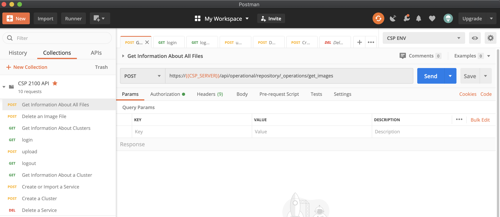
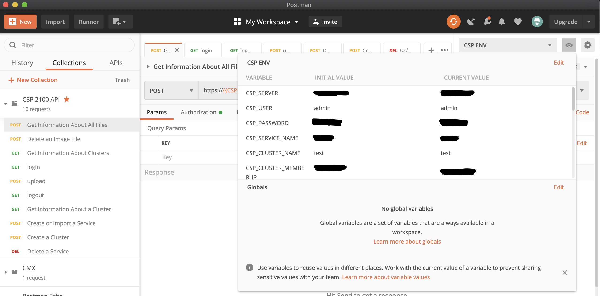
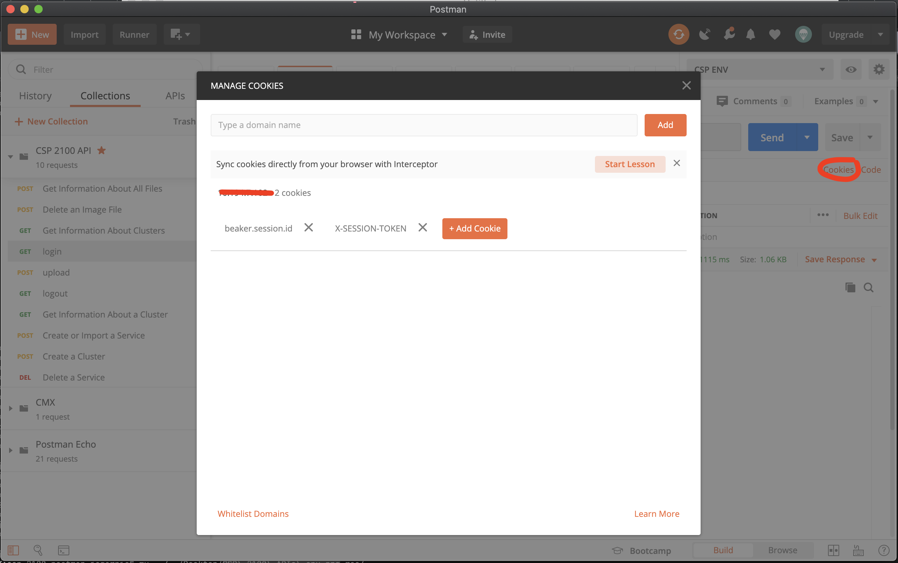

# CSP 2100 APIs using Postman

This repo aims to give you the resources for using CSP 2100 APIs with [Postman](https://www.postman.com/).

## Import CSP 2100 collection

Import the CSP 2100 collection in the [src folder](./src/CSP_2100_API.postman_collection.json).
Once imported, you will be able to see all the current APIs available for testing:

## CSP Postman env

In order to work with the API, you will need a Postman environment, as you saw on the API collection, the API authentification or parameters are set using {{CSP_XXX}}. Use the example file in the [src folder](./src/CSP_2100_ENV.postman_environment.json) and then import the JSON env file in Postman.
As you see, I've put lot of different parameters which mostly is used for creating a service, which contained in this example 2 VNICs and 2 local disks in qcow2 format. Most of the params are test or JSON and feel free to adapth them depending on your need.
Once imported, select it before using the APIs, this should look like this:

## Using the collection

Now you're ready to use the collection in order to play with CSP 2100 APIs.
Here are some things to know also:

1. The upload API requires the login to be done before, the session token will be stored in the cookies, you can see them by clicking the cookies link (see red circle on the picture bellow):

2. Once you're done with the upload and do not need the session anymore, use the logout API and also make sure you remove the "breaker.session.id" and "X-SESSION-TOKEN" are removed on the cookie manager of Postman.
